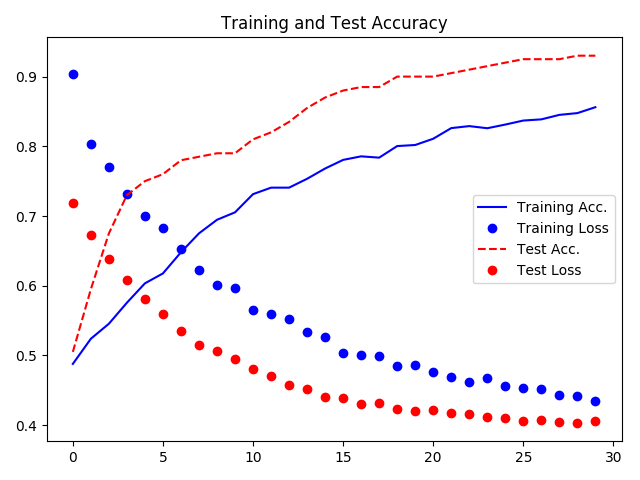
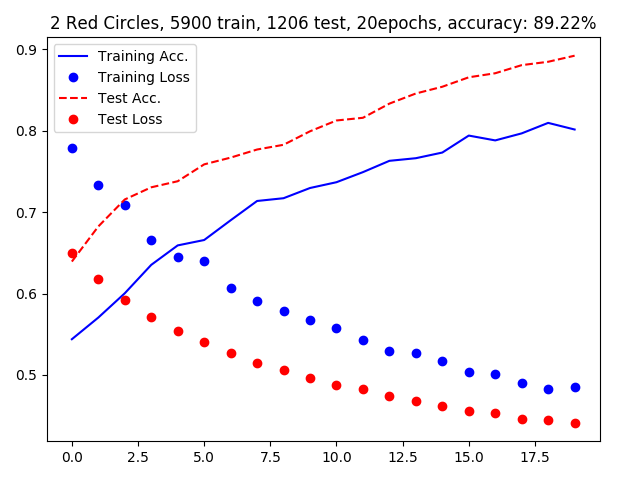
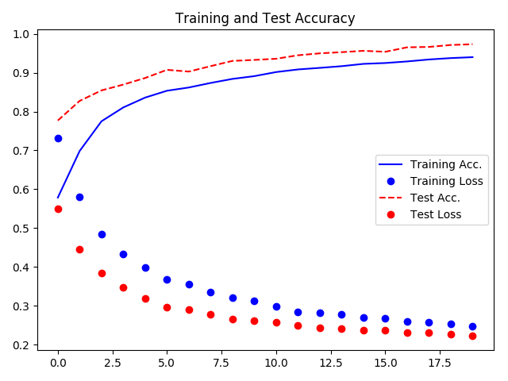

# Findings
This file is used to collect my thoughts and ~~prayers~~ findings. 

## General
Training on the CPU becomes a pain really fast, investing the time into getting tensorflow-gpu/CUDA running was worth the while.

## Training
When working with a small dataset, it is best not to touch the convolutional base, but only retrain the classifier layer.
This is a usefull guide to use as a starting point when getting into transfer training: [link](https://towardsdatascience.com/transfer-learning-from-pre-trained-models-f2393f124751)

## Results
Just writing some results down as i go, will collect everything in a more structured manner(some kind of tabular file) also.

### 2 circles
#### 400 Train, 100 Test, Block 4,5 + classifier trained, 30 epochs
 Test-set classification accuracy: 60.50%
 
#### 2900 train, 100 test, block 4,5 + classifier, 20 epochs
 Test-set classification accuracy: 90.00%
 not overfiting yet, lets try with more epochs
 
#### 2900 train, 100 test, block 4,5 + classifier, 30 epochs
 got up to 93% accuracy with this setup, still no overfitting in sight.  
 

#### 5900 train, 1000 test, block 4,5 + classifier, 40 epochs
 got up to 93,37% accuracy
 

### 3 circles
### 10000 train, 1000 test, block 4,5 + classifier, 20 epochs
figures with 3 circles. 20000 training samples(10000 for each class) and 2000 test samples(1000 each class)
trained for 20 epochs, last 2 convolutional layers(VGG blocks 4&5) and classifier where retrained.
 got up to 97,35% accuracy
 

